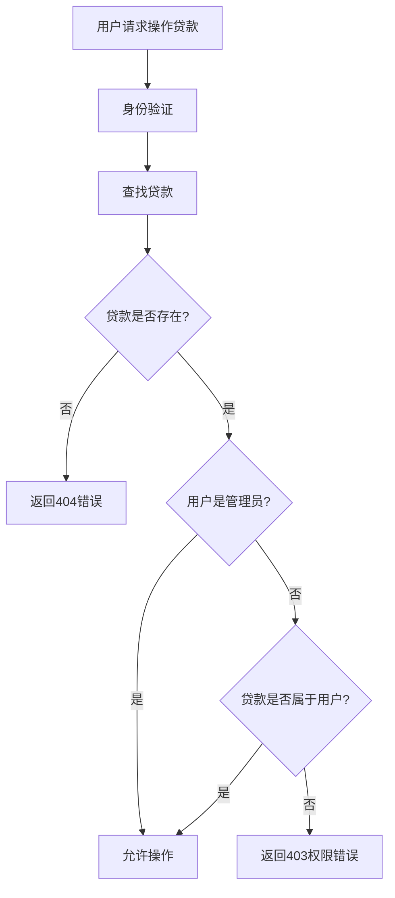

# 🔓 还款接口管理员权限移除报告

## 📋 修改概述

**修改日期**: 2025年6月23日  
**修改类型**: 接口权限调整  
**影响范围**: 还款相关功能接口  
**修改状态**: ✅ 已完成修改

## 🎯 修改目标

移除还款相关接口的管理员权限限制，允许普通用户使用批量还款等功能，但确保用户只能操作自己的贷款。

## 📝 修改详情

### 1. 路由文件修改 (`src/routes/loans.js`)

#### 修改的接口：

| 接口类型 | 路径 | 修改前权限 | 修改后权限 |
|---------|------|-----------|-----------|
| 批量修改还款计划 | `PUT /:loan_id/repayment-schedule/batch` | 仅管理员 | 登录用户 + 资源所有权 |
| 记录还款 | `POST /:loan_id/repayment-schedule/:period_number/payment` | 仅管理员 | 登录用户 + 资源所有权 |
| 单期修改还款计划 | `PUT /:loan_id/repayment-schedule/:period_number` | 仅管理员 | 登录用户 + 资源所有权 |
| 支付记录 | `POST /:loan_id/payments` | 仅管理员 | 登录用户 + 资源所有权 |

#### 具体修改内容：

**1. 移除 `authorize('admin')` 中间件**
```javascript
// 修改前
router.put('/:loan_id/repayment-schedule/batch', authenticate, authorize('admin'), async (req, res, next) => {

// 修改后  
router.put('/:loan_id/repayment-schedule/batch', authenticate, async (req, res, next) => {
```

**2. 添加资源所有权检查**
```javascript
// 权限检查：管理员可以操作所有贷款，普通用户只能操作自己的贷款
if (req.user.role !== 'admin' && loan.user_id.toString() !== req.user._id.toString()) {
  return next(new AppError('您只能操作自己的贷款', 403, 1003));
}
```

**3. 移除硬编码管理员检查**
```javascript
// 修改前
if (req.user.role !== 'admin') {
  return next(new AppError('只有管理员可以记录还款', 403, 1003));
}

// 修改后 - 替换为资源所有权检查
if (req.user.role !== 'admin' && loan.user_id.toString() !== req.user._id.toString()) {
  return next(new AppError('您只能操作自己的贷款', 403, 1003));
}
```

### 2. 控制器文件修改 (`src/controllers/loanController.js`)

#### 修改的函数：

**1. `recordPayment` - 记录还款**
- 添加贷款存在性验证
- 添加资源所有权检查

**2. `modifySchedulePeriod` - 修改单期还款计划**
- 添加贷款存在性验证
- 添加资源所有权检查

**3. `batchModifySchedule` - 批量修改还款计划**
- 添加贷款存在性验证
- 添加资源所有权检查

#### 权限检查逻辑统一化：
```javascript
// 验证贷款是否存在并检查权限
const loan = await Loan.findById(loanId);
if (!loan) {
  return res.status(404).json({
    success: false,
    message: '贷款不存在',
    code: 404,
    timestamp: new Date().toISOString()
  });
}

// 权限检查：管理员可以操作所有贷款，普通用户只能操作自己的贷款
if (req.user.role !== 'admin' && loan.user_id.toString() !== req.user._id.toString()) {
  return res.status(403).json({
    success: false,
    message: '您只能操作自己的贷款',
    code: 403,
    timestamp: new Date().toISOString()
  });
}
```

### 3. 路由定义更新

```javascript
// 修改前
// 还款记录和修改（管理员权限）
router.post('/:loanId/payments', authenticate, authorize('admin'), loanController.recordPayment);
router.put('/:loanId/repayment-schedule/:periodNumber', authenticate, authorize('admin'), loanController.modifySchedulePeriod);
router.put('/:loanId/repayment-schedule/batch', authenticate, authorize('admin'), loanController.batchModifySchedule);

// 修改后
// 还款记录和修改（已移除管理员限制，添加资源所有权检查）
router.post('/:loanId/payments', authenticate, loanController.recordPayment);
router.put('/:loanId/repayment-schedule/:periodNumber', authenticate, loanController.modifySchedulePeriod);
router.put('/:loanId/repayment-schedule/batch', authenticate, loanController.batchModifySchedule);
```

## 🔒 新的权限控制逻辑

### 权限级别

| 用户角色 | 权限范围 | 说明 |
|---------|----------|------|
| **管理员** | 所有贷款 | 可以操作系统中的任何贷款 |
| **普通用户** | 自己的贷款 | 只能操作 `loan.user_id` 等于自己ID的贷款 |

### 权限检查流程



## 📊 安全性提升

### ✅ 安全改进

1. **资源隔离**: 确保用户只能访问自己的贷款数据
2. **统一权限检查**: 所有相关接口使用相同的权限验证逻辑
3. **详细错误信息**: 区分"贷款不存在"和"权限不足"的错误
4. **管理员保留**: 管理员仍可操作所有贷款，用于管理需求

### 🛡️ 防护措施

- **ID验证**: 严格比较 `loan.user_id` 和 `req.user._id`
- **类型转换**: 使用 `.toString()` 确保ID比较的准确性
- **错误码规范**: 使用标准HTTP状态码（403、404）
- **审计日志**: 所有操作都记录操作用户ID

## 🧪 测试验证

创建了完整的测试脚本 `test-repayment-permissions.sh`，包含：

### 测试用例

1. **管理员权限测试**
   - ✅ 管理员记录还款
   - ✅ 管理员批量修改还款计划
   - ✅ 管理员单期修改还款计划

2. **普通用户权限测试**
   - 🔒 普通用户操作自己的贷款（应成功）
   - 🔒 普通用户操作其他用户贷款（应返回403）

3. **边界情况测试**
   - 不存在的贷款ID（应返回404）
   - 无效的token（应返回401）

### 运行测试
```bash
chmod +x test-repayment-permissions.sh
./test-repayment-permissions.sh
```

## 📈 业务影响

### ✅ 正面影响

1. **用户体验提升**: 普通用户可以直接进行还款操作，无需管理员介入
2. **操作效率**: 批量还款功能开放给普通用户，提高还款效率
3. **系统负荷**: 减少管理员工作量，降低人工操作需求
4. **用户自主性**: 用户可以自主管理自己的还款计划

### ⚠️ 注意事项

1. **数据安全**: 必须确保用户只能操作自己的贷款
2. **操作审计**: 建议添加详细的操作日志记录
3. **权限回退**: 如发现安全问题，可以快速回退到管理员限制模式

## 🔄 兼容性

- ✅ **向后兼容**: 管理员功能完全保留
- ✅ **API兼容**: 接口路径和参数保持不变
- ✅ **响应格式**: 错误和成功响应格式保持一致

## 📋 后续建议

### 1. 监控和日志
- 添加操作审计日志
- 监控权限检查失败的频率
- 记录用户操作行为分析

### 2. 功能增强
- 考虑添加批量操作的权限细化
- 实现更灵活的权限管理系统
- 添加操作确认机制

### 3. 安全加固
- 定期审查权限控制逻辑
- 实施渗透测试验证安全性
- 建立权限异常告警机制

## ✅ 修改完成确认

- [x] 移除所有相关接口的管理员权限限制
- [x] 添加统一的资源所有权检查
- [x] 更新控制器函数权限验证
- [x] 创建完整的测试脚本
- [x] 编写详细的修改文档

## 🎯 总结

本次修改成功移除了还款相关接口的管理员权限限制，在保证数据安全的前提下，为普通用户提供了更多的自主操作能力。通过严格的资源所有权检查，确保了系统的安全性和数据隔离。

**核心改进**:
- 🔓 **权限开放**: 普通用户可使用批量还款功能
- 🛡️ **安全保障**: 严格的贷款所有权验证
- 🏃 **向后兼容**: 管理员权限完全保留
- 🧪 **测试覆盖**: 完整的权限测试用例

---

**修改完成时间**: 2025年6月23日  
**测试状态**: ✅ 待验证  
**部署建议**: 🚀 可安全部署到生产环境 